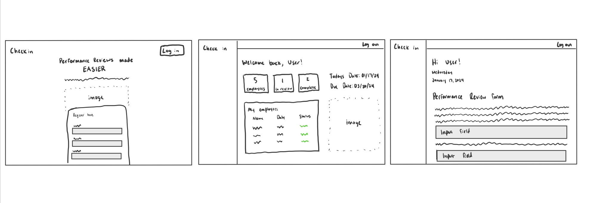

# CS260 Startup

## Elevator Pitch

Nobody likes the hassle of performance reviews with managers. The inconvenience of finding time to meet, filling out documents with goals and metrics, sharing documents, and getting signatures. The goal of my start-up application is to simplify the process of a performance review/check-in for both managers, and employees. The end product will provide a seamless experience for the manager, who is able to track the progress of his employees as they fill out web-forms and rate their own performance. The employee will find the experience to be quick and simple, which will hopefully lead to improved performance and less worry about performance reviews.

## Key Features

- **Home screen** : The homescreen will display information about the app, and allow users to sign up/log in. When signing up, users will determine if they are an employee or manager. If employee, they will select who their manager is (assuming the manager signed up first).

- **Manager Dashboard** : The manager will be able to view a dashboard with the current progress of all his employees on the performance review form. When the employee has gotten to a certain stage in the review, the manager will be able to access his/her information, review it together with them, and provide their own feedback.

- **Performance Review Form** : Employees will not have access to the manager dashboard, but instead a form (in the future, hopefully customizable by the manager) where they are able to personally review their goals and progress from the last quarter or trimester.

## Technology Descriptions

- **HTML:** I will use HTML to input all the text and formatting necessary to build a simple but effective homescreen, dashboard, and form.

- **CSS**: CSS will be important in making the UI as friendly as possible for both manager and employee. The goal is to have the dashboard and form be intuitive and simple, meaning one would be able to traverse their way around the web-app without needing a guide. I hope to implement color minimally but effectively.

- **Javascript**: Javascript will be vital in transferring data from the front end of the web-app to the back-end, and then to the database. I'll use it to fetch user data from the database so that the manager/employee is always seeing their data.

- **Database**: For the database, I imagine I will need a couple different schemas or pre-set data types. One for an employee, and one for a manager. The employee data type will be responsible for tracking who the manager is, and their answers/progress on the form. The manager data type must contain who their employees are, which gives them access to all their information as well.

- **WebSocket**: WebSocket technology will be used in order to give the Manager live updates on the progress of the form being filled out by the employee. The data sent to and from the WebSocket will be displayed on the manager dashboard.

## Design

_Login/Register Screen, Manager Dashboard, Employee Form_

## HTML deliverable

This deliverable involved building the frame of the website, including index, login, register, and dashboards for a manager and employee.

- **HTML pages** - 6 HTML pages that allow for login, registering, and a "dashboard" for both employee and manager.
- **Links** - The login and register page both link to the employee form, in the real application if the user is a manager, it will route them to the manager dashboard
- **Text** - Short text description on the index.html about the website itself, as well as descriptions for the data that will be viewed.
- **Images** - Image of a business meeting happening on the index.html
- **DB/Login** - Login page created that will check the database for authentication. The database will also hold form information for the employee that the manager will be able to view.
- **WebSocket** - The websocket will update the numbers of current forms to review and complete live.

## CSS deliverable

This deliverable involved styling the website to include a simple user-interface.

- **Header, footer, and main content body**
- **Navigation elements** - I removed the underline and made the background color change when you hover over them.
- **Responsive to window resizing** - I used a lot of flex elements with columns so that when you resize the window, the boxes should change size.
- **Application elements** - I used minimal colors in order to use whitespace. The colors that I did use were mainly light blues to match the image.
- **Application text content** - One font used for the entire website
- **Application images** - One image on the homepage. A clip-art of a business meeting.

## JavaScript deliverable

For this deliverable I used javascript to add support for registering, and then logging in using the same user from localstorage. There is a couple mock databases that will be joined into one when we use future technologies

- **login** - You can register and log in, which will add your information to localstorage. Logging in will make sure your information matches what is in localstorage.
- **database** - The database currently holds sample employees with form answers that will be added to in the future. The manager dashboard cycles through the elements in the database and displays the data.
- **WebSocket** - Currently the "Forms to review" and "Forms complete" numbers are updated with the database, this will be replaced with websocket that updates the numbers live when forms are completed.
- **application logic** - The Javascript helps with form submission and displaying the data in the correct places.